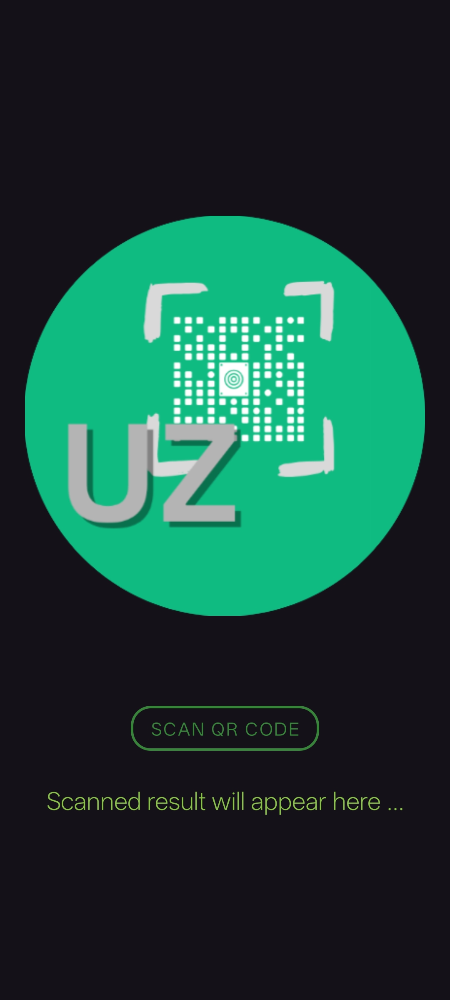
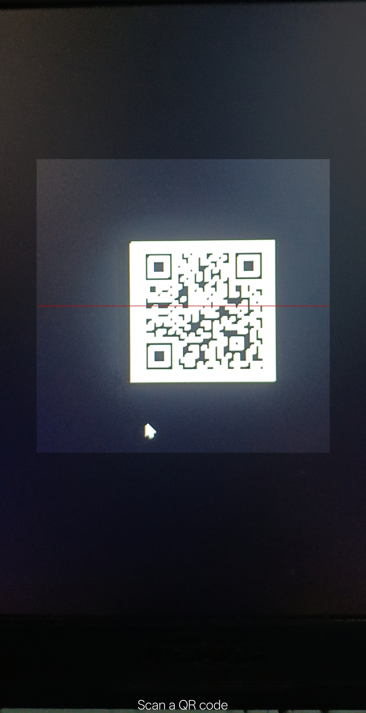
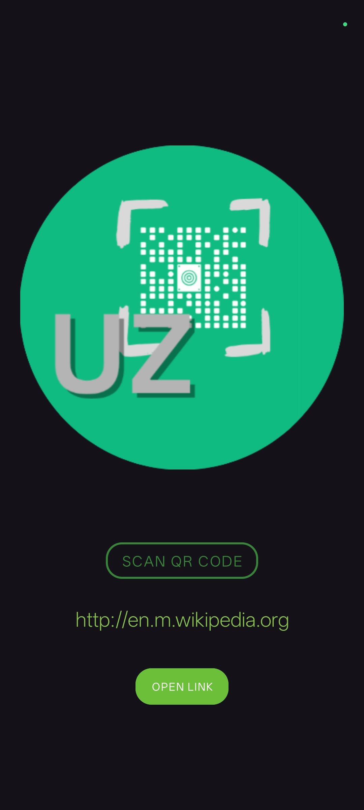

## 📌 5. UzQrScanner (`PRODIGY_AD_05`)

A QR Code Scanner app built with Android Studio that uses the device camera to scan QR codes. Once scanned, the app extracts the encoded information and displays it on the screen. If the QR code contains a link, users can open it directly in their browser.


# UzQrScanner
**PRODIGY_AD_05**

## Summary
UzQrScanner is an Android app that scans QR codes using the device camera. It extracts the content and displays it, with the option to open links directly in the browser.

## Features
- 📷 Scan QR codes in real-time  
- 📝 Display scanned content (text/URL)  
- 🌐 Open URLs directly in browser  
- ⚡ Fast & lightweight  

## Tech Stack
- Android Studio (Java/Kotlin)  
- ZXing ("Zebra Crossing") library  
- CameraX API  

## Screenshots

.
  

## How to Run
1. Clone the repo:
   ```bash
   git clone https://github.com/syeduzair-it/PRODIGY_AD_05.git
   cd PRODIGY_AD_05
